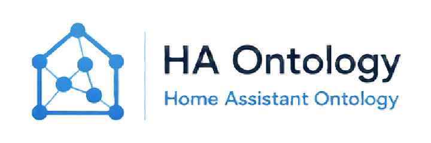

# Home Assistant Ontology

<p align="center">
  
</p>

A local-first Home Assistant custom integration that discovers your smart home's
structure — areas, floors, devices, entities, automations, scenes, scripts,
domains, integrations, and labels — and synchronizes it into a local
[Memgraph](https://memgraph.com/) graph database as a queryable ontology.

No cloud dependency: all discovery and synchronization happens locally between
Home Assistant and your own Memgraph instance.

## Features

- **Guided setup** via Settings → Devices & Services (no YAML editing required).
- **Connection health checks** with clear, redacted error reporting if the
  graph database is unreachable.
- **Full discovery** of areas, floors, devices, entities, automations, scenes,
  scripts, domains, integrations, and labels.
- **Idempotent initial sync** — builds a queryable graph of your home without
  creating duplicates on repeated runs.
- **Incremental, event-driven updates** — renaming an area, moving a device,
  or adding/removing/renaming an entity updates only the affected node(s),
  without a full rebuild. Rapid state changes are debounced.
- **Services**: `ontology.rebuild`, `ontology.resync`, `ontology.sync_entity`,
  `ontology.validate`.
- **Sensors** for sync health, node/relationship counts, last sync time,
  last error, and schema version.
- **Diagnostics** with connection status, element counts, and schema version
  — credentials and secrets are always redacted.
- **Schema-version safety** — a mismatched graph schema version blocks setup
  and raises a repair issue rather than silently proceeding.
- **Outage resilience** — a sustained connection failure raises a repair issue
  that automatically clears once the connection recovers.

## Requirements

- A running Home Assistant instance (OS/Supervised/Core).
- A local [Memgraph](https://memgraph.com/) instance reachable over Bolt. Two options:
  - **Home Assistant OS / Supervised**: install the bundled
    [Memgraph add-on](memgraph_addon/) (see below).
  - **Home Assistant Container / Core**, or any other setup: run Memgraph
    yourself, e.g.:

    ```sh
    docker run -p 7687:7687 memgraph/memgraph-platform
    ```

## Installation

### Memgraph add-on (Home Assistant OS / Supervised only)

1. Go to **Settings → Add-ons → Add-on Store → ⋮ → Repositories** and add
   `https://github.com/hannovdm/hass-ontology`.
2. Install and start the **Memgraph** add-on. See
   [memgraph_addon/README.md](memgraph_addon/README.md) for details.

### HACS (recommended, for the integration itself)

1. Add this repository as a custom repository in [HACS](https://hacs.xyz/)
   (category: Integration).
2. Install "Home Assistant Ontology" from HACS.
3. Restart Home Assistant.

### Manual

1. Copy `custom_components/ontology/` into `<config>/custom_components/ontology/`.
2. Restart Home Assistant.

## Setup

1. Go to **Settings → Devices & Services → Add Integration**, search for
   "Ontology".
2. Enter the Memgraph `host`, `port`, and credentials (if configured). If
   using the bundled add-on, use your Home Assistant host's IP address and
   port `7687`.
3. Wait for the initial synchronization to complete — `sensor.ontology_health`
   will report healthy once done.

See [specs/001-ha-ontology-integration/quickstart.md](specs/001-ha-ontology-integration/quickstart.md)
for detailed end-to-end validation scenarios.

## Development

```sh
pip install -e .[dev]

# Windows
.\scripts\test-windows.ps1

# Linux/macOS
pytest
```

Integration tests require Docker (via `testcontainers`) to run a real
Memgraph instance. See [specs/001-ha-ontology-integration/](specs/001-ha-ontology-integration/)
for the full spec, plan, and task list.

## License

See repository license terms.
