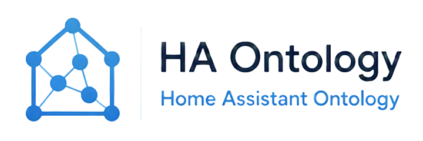

# Home Assistant Ontology

<p align="center">
  
</p>

A local-first Home Assistant custom integration that discovers your smart home's
structure — areas, floors, devices, entities, automations, scenes, scripts,
domains, integrations, and labels — and synchronizes it into a local
[Memgraph](https://memgraph.com/) graph database as a queryable ontology.

No cloud dependency: all discovery and synchronization happens locally between
Home Assistant and your own Memgraph instance.

## What is Ontology

An **ontology** is a structured model that defines the key concepts in a domain and the relationships between them. Think of it as a shared vocabulary combined with a map of how things are connected. For example, in an energy company, an ontology might define assets, wells, pipelines, maintenance activities, and employees, and specify how each relates to the others. Unlike a simple database schema, an ontology captures meaning and context, enabling systems and people to interpret information consistently.

The main **business challenge ontology solves** is the fragmentation of data and knowledge across systems, teams, and business units. Organizations often have the same concept represented differently in different applications, making it difficult to integrate data, search effectively, automate processes, or apply AI. An ontology creates a common semantic layer that allows information from multiple sources to be connected, improving data quality, interoperability, discovery, analytics, and AI-driven insights.

Ontology is particularly valuable for initiatives involving **knowledge management, digital twins, data governance, enterprise search, AI copilots, and analytics platforms**. By providing clear relationships and business definitions, it helps machines reason across data rather than simply storing or retrieving it. This reduces ambiguity, accelerates decision-making, and enables more intelligent automation.

The **target audience** for ontology includes enterprise architects, data architects, knowledge managers, data governance teams, AI and machine learning teams, business analysts, and domain experts. Executive stakeholders also benefit indirectly because ontologies improve the accuracy of reporting, AI solutions, and business insights, ultimately helping organizations make better and faster decisions from their data.

A basic ontology is often visualized as a network of business entities and relationships. Using an energy company as an example:

[Oil Field]
     |
 contains
     v
[Well] ---- produces ----> [Hydrocarbon]
     |
 connected to
     v
[Pipeline] ---- feeds ----> [Refinery]
     |
 maintained by
     v
[Maintenance Activity]
     |
 performed by
     v
[Technician]

[Sensor] ---- monitors ----> [Well]
[Sensor] ---- generates ----> [Measurement]
[Measurement] ---- indicates ----> [Equipment Condition]

The ontology doesn't just store data; it defines the **meaning** of the data. For example, it explicitly states that a Well is located in an Oil Field, a Pipeline transports production from a Well, and a Technician performs Maintenance Activities. Once these relationships are defined, systems can understand how business concepts connect, even if the data comes from different applications.

A practical example: if an engineer asks, **"Which wells in the North Field have experienced abnormal pressure readings and had maintenance performed in the last 30 days?"**, the ontology allows the system to traverse relationships between Wells → Sensors → Measurements → Maintenance Activities. Without an ontology, that query might require manually joining data across SCADA systems, maintenance systems, asset registries, and data warehouses. With an ontology, the business meaning is already connected, making search, analytics, AI copilots, and digital twins far more powerful.

In essence, an ontology becomes the business knowledge graph of the enterprise: the vocabulary, rules, and relationships that allow both humans and AI to understand how the company's assets, operations, people, and processes fit together.

## Home Assistant Ontology

The key realization is that Home Assistant already contains about 70% of the ontology:

Areas
Floors
Devices
Entities
Labels
Persons
Automations
Scenes
Scripts
Energy Dashboard
Device relationships

What Home Assistant lacks is the **semantic layer** (the meaning and relationships between those objects).

You want to allow questions such as:

"Which rooms have devices with low batteries?"
"What appliances currently consume electricity?"
"Which automations depend on the garage motion sensor?"
"What is powered by my 48kg gas cylinder?"
"Show all entities associated with the dishwasher."

In ontology terms, Home Assistant becomes a **home digital twin**, where Areas, Devices, Entities, People, Energy Sources, Automations, and Events are all connected through explicit relationships rather than just entity IDs. For a technically advanced HA setup, that's where ontology starts becoming genuinely valuable rather than just academic.

## Features

- **Guided setup** via Settings → Devices & Services (no YAML editing required).
- **Connection health checks** with clear, redacted error reporting if the
  graph database is unreachable.
- **Full discovery** of areas, floors, devices, entities, automations, scenes,
  scripts, domains, integrations, and labels.
- **Idempotent initial sync** — builds a queryable graph of your home without
  creating duplicates on repeated runs.
- **Incremental, event-driven updates** — renaming an area, moving a device,
  or adding/removing/renaming an entity updates only the affected node(s),
  without a full rebuild. Rapid state changes are debounced.
- **Services**: `ontology.rebuild`, `ontology.resync`, `ontology.sync_entity`,
  `ontology.validate`, `ontology.query`, `ontology.refresh_semantics`,
  `ontology.export_overrides`, `ontology.import_overrides`,
  `ontology.search`, `ontology.area_context`, `ontology.device_context`,
  `ontology.entity_context`, `ontology.automation_dependencies`,
  `ontology.impact_analysis`, `ontology.export_context`.
- **Sensors** for sync health, node/relationship counts, last sync time,
  last error, and schema version.
- **Diagnostics** with connection status, element counts, semantic
  classification counts, open validation finding counts, and schema version
  — credentials and secrets are always redacted.
- **Schema-version safety** — a mismatched graph schema version blocks setup
  and raises a repair issue rather than silently proceeding.
- **Outage resilience** — a sustained connection failure raises a repair issue
  that automatically clears once the connection recovers.
- **Semantic classification** — entities are classified into semantic types
  (e.g. lighting, climate, security) to support richer querying and validation.
- **Read-only query service** (`ontology.query`) — run validated, deny-listed
  Cypher queries against the graph directly from a service call, with results
  capped and truncation reported.
- **Ontology validation** — detects graph consistency issues (orphaned nodes,
  missing relationships, schema drift) and surfaces them as categorized,
  severity-ranked findings.
- **User overrides** — export and re-import user-authored graph relationships
  (e.g. manual groupings) as a versioned, redacted JSON payload, independent
  of discovery-driven data.
- **Dashboard sync** — Lovelace dashboard/card structure is synchronized into
  the graph so dashboards can be queried like any other part of the ontology.
- **Backend API** (`websocket_api`) — read-only `ontology/area_context`,
  `ontology/entity_context`, and `ontology/search` commands for building
  frontend tooling (e.g. the sidebar panel) or ad-hoc Developer Tools queries.
- **Sidebar panel** — an optional "Ontology" sidebar panel to browse areas,
  devices, and entities and search the graph, backed entirely by the
  `websocket_api` commands above.
- **Predefined query tools** — bounded, transport-agnostic services
  (`ontology.search`, `ontology.area_context`, `ontology.device_context`,
  `ontology.entity_context`, `ontology.automation_dependencies`) shared by
  every access channel below (Assist, MCP, and direct service calls).
- **Ask Home Assistant Assist** — native Assist intents (no LLM required) let
  you ask conversational questions like "what automations depend on the
  kitchen light?" or "what devices are in the office?".
- **Impact analysis** (`ontology.impact_analysis`) — bounded entity/device/area
  traversal that answers "what would be affected if I changed/removed this?",
  aggregating related automations, scripts, scenes, dashboards, and semantic
  assets.
- **Local AI context export** (`ontology.export_context`) — allow-listed JSON
  context documents (area, entity, device, automation, impact, whole-home) for
  local AI agents, with zero secrets/tokens/credentials ever included.
- **Local MCP-compatible endpoint** — an opt-in (disabled by default), local-only,
  token-authenticated JSON-RPC endpoint (`/api/ontology/mcp`) exposing the same
  bounded, read-only tools to local MCP clients. Enable it via the integration's
  options and regenerate its access token any time via the
  `button.regenerate_mcp_token` control entity.
- **Audit and diagnostics for agent access** — every Assist query and MCP tool
  call is recorded (redacted, no raw prompts/tokens, 30-day retention) and
  summarized in diagnostics.

## Requirements

- A running Home Assistant instance (OS/Supervised/Core).
- A local [Memgraph](https://memgraph.com/) instance reachable over Bolt. Two options:
  - **Home Assistant OS / Supervised**: install the bundled
    [Memgraph add-on](memgraph_addon/) (see below).
  - **Home Assistant Container / Core**, or any other setup: run Memgraph
    yourself, e.g.:

    ```sh
    docker run -p 7687:7687 memgraph/memgraph-platform
    ```

## Installation

### Memgraph add-on (Home Assistant OS / Supervised only)

1. Go to **Settings → Add-ons → Add-on Store → ⋮ → Repositories** and add
   `https://github.com/hannovdm/hass-ontology`.
2. Install and start the **Memgraph** add-on. See
   [memgraph_addon/README.md](memgraph_addon/README.md) for details.

### HACS (recommended, for the integration itself)

1. Add this repository as a custom repository in [HACS](https://hacs.xyz/)
   (category: Integration).
2. Install "Home Assistant Ontology" from HACS.
3. Restart Home Assistant.

### Manual

1. Copy `custom_components/ontology/` into `<config>/custom_components/ontology/`.
2. Restart Home Assistant.

## Setup

1. Go to **Settings → Devices & Services → Add Integration**, search for
   "Ontology".
2. Enter the Memgraph `host`, `port`, and credentials (if configured). If
   using the bundled add-on, use your Home Assistant host's IP address and
   port `7687`.
3. Wait for the initial synchronization to complete — `sensor.ontology_health`
   will report healthy once done.

See [specs/001-ha-ontology-integration/quickstart.md](specs/001-ha-ontology-integration/quickstart.md)
for detailed end-to-end validation scenarios.

## Development

```sh
pip install -e .[dev]

# Windows
.\scripts\test-windows.ps1

# Linux/macOS
pytest
```

Integration tests require Docker (via `testcontainers`) to run a real
Memgraph instance. See [specs/001-ha-ontology-integration/](specs/001-ha-ontology-integration/)
for the full spec, plan, and task list.

### Project task automation

The `Update project item status` workflow moves task issues in GitHub Projects
when a pull request uses a closing keyword such as `Closes #123`, `Fixes #123`,
or `Resolves #123`:

- Opening or reopening the pull request sets the linked item to `Review`.
- Merging the pull request sets the linked item to `Done`.

Create a repository Actions secret named `PROJECT_TOKEN` containing a token
with read/write access to Projects and read access to this repository. For a
classic personal access token used with a private repository, grant the
`project` and `repo` scopes. The project must have a single-select field named
`Status` with options named `Review` and `Done`.

## Ontology Explorer Graph

The **Ontology Explorer** panel visualizes your home's graph as an interactive canvas.

### Graph controls

| Control | Action |
|---------|--------|
| Click a node | Select and view safe properties |
| **Expand one hop** (button) | Load direct relationships for the selected node |
| Search box | Find nodes by name or ID and focus them in the graph |
| Node/relationship type checkboxes | Filter visible elements |
| **Zoom in / Zoom out** (toolbar) | Zoom the canvas |
| **Fit graph** (toolbar) | Fit all visible nodes in view |
| **Reset view** (toolbar) | Reset to the post-load default viewport |
| Drag a node | Reposition it |
| Keyboard focus on node list | Navigate and select nodes without a mouse |

### Display limits

The initial view loads up to **500 nodes** (areas and directly assigned devices). Expand individual nodes to load one-hop neighbours (up to 250 nodes / 500 edges per expansion).

### Node styles

| Style | Meaning |
|-------|---------|
| Hexagonal node | Area |
| Rounded rectangle | Device / Entity |
| Dashed border | Unavailable |
| Diamond with amber border | Validation finding |
| Dotted group | Unassigned devices (presentation only) |

### Live updates

The panel subscribes to graph changes automatically. When the Ontology integration syncs a change:

- **Upsert events** refresh visible nodes' properties.
- **Remove events** remove nodes and relationships from the canvas.
- **Reconcile events** (after full rebuild/resync) reload the entire snapshot.

A **stale indicator** appears if the subscription is interrupted. The panel reconnects automatically with bounded exponential backoff.

### Privacy boundary

- The browser never connects directly to Memgraph or the internal GraphQL adapter.
- All operations are named (no query text is accepted from the browser).
- Node properties are allowlisted and passed through the integration's redaction rules.
- Credentials, tokens, and internal hostnames are never sent to the browser.

### Accessibility

The **Graph nodes** list in the sidebar mirrors the canvas and is keyboard-operable. Screen readers can navigate the node list, select nodes, and read their type and status without touching the canvas.

### Memgraph Lab (administrators only)

When the Memgraph add-on is running **Memgraph Enterprise** with a verified read-only database user, administrators see a **Memgraph Lab** section in the sidebar. This opens Memgraph Lab through Home Assistant Supervisor ingress. Lab is unavailable on Community edition and for non-administrators.

## License

See repository license terms.
