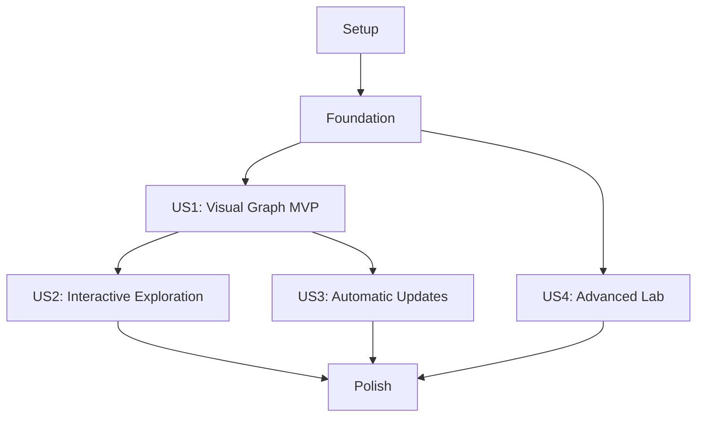

# Tasks: Interactive Ontology Graph Visualization

**Input**: Design documents from `specs/005-ontology-graph-visualization/`

**Prerequisites**: `plan.md`, `spec.md`, `research.md`, `data-model.md`, `contracts/`, `quickstart.md`

**Tests**: Tests are required by Constitution Principle VII. Write each story's tests first and confirm they fail for the intended missing behavior before implementation.

**Organization**: Tasks are grouped by user story so each increment has an explicit independent validation checkpoint.

## Format: `[ID] [P?] [Story] Description`

- **[P]**: Can run in parallel because it touches different files and does not depend on an incomplete task in the same phase.
- **[Story]**: Maps the task to a user story from `spec.md`.
- Every task names the exact file or directory it changes.

## Phase 1: Setup (Shared Infrastructure)

**Purpose**: Pin local frontend/server dependencies and establish the multi-runtime test skeleton.

- [X] T001 Resolve and lock exact Node.js 22-compatible `graphql`, `@apollo/server`, and `neo4j-driver` versions with licenses and clean-lockfile reproducibility in `memgraph_addon/graphql/package.json` and `memgraph_addon/graphql/package-lock.json`
- [X] T002 [P] Vendor an exact Cytoscape.js release with checksum and license provenance in `custom_components/ontology/panel/vendor/cytoscape.esm.min.js` and `custom_components/ontology/panel/vendor/NOTICE.md`
- [X] T003 [P] Lock exact Playwright dependencies and configure desktop/mobile projects with canvas-pixel support in `tests/browser/package.json`, `tests/browser/package-lock.json`, and `tests/browser/playwright.config.js`
- [X] T004 [P] Add GraphQL and visualization test commands to the Windows developer workflow in `scripts/test-windows.ps1`

---

## Phase 2: Foundational (Blocking Prerequisites)

**Purpose**: Build the fixed read-only GraphQL adapter, authenticated Home Assistant gateway, shared presentation validation, and resilient add-on process model required by every story.

**CRITICAL**: No user story implementation begins until this phase passes its focused tests.

### Tests

- [X] T005 [P] Write failing schema and resolver tests proving query-only fields, parameterized Cypher, result bounds, and absence of mutations/arbitrary Cypher in `memgraph_addon/graphql/server.test.js` and `memgraph_addon/graphql/resolvers.test.js`
- [X] T006 [P] Write failing tests for backend selection/equivalence, named operations, timeouts, redaction, stable IDs, property bounds, setup/reload/unload/close, and non-fatal unavailability in `tests/unit/test_graph_gateway.py`, `tests/contract/test_graph_backend_contract.py`, and `tests/integration/test_graph_gateway_lifecycle.py`
- [X] T007 [P] Write failing transport/config-flow tests proving bearer authentication, cross-container reachability, optional discovery/manual GraphQL settings, direct-backend fallback, and no browser exposure of URLs/tokens/query text in `tests/contract/test_graph_gateway_contract.py`, `tests/contract/test_config_flow_contract.py`, `tests/unit/test_config_flow_success.py`, `tests/unit/test_config_flow_failure.py`, and `tests/integration/test_graphql_transport.py`
- [X] T008 [P] Write failing add-on tests for independent process health, signal propagation, unpublished ports, ingress base-path/WebSocket proxying, exact Lab/Memgraph image digests, licenses, and amd64/aarch64 availability in `tests/contract/test_memgraph_addon_processes.py`

### Implementation

- [X] T009 Implement the fixed Query-only SDL from `contracts/graphql-schema.graphql` in `memgraph_addon/graphql/schema.graphql`
- [X] T010 Implement bounded, parameterized `initialGraph`, `expandNode`, `searchGraph`, `graphElement`, and `graphHealth` resolvers with safe serialization in `memgraph_addon/graphql/resolvers.js`
- [X] T011 Implement the internal-network Apollo server on port 4000 with bearer authentication, disabled production introspection, request/body limits, timeouts, and sanitized operation logging in `memgraph_addon/graphql/server.js` (validated by T005 and T007)
- [X] T012 [P] Define graph operation names, backend/config keys, default/hard limits, revision buffer size, and update debounce constants in `custom_components/ontology/const.py`
- [X] T013 Implement the common GraphBackend interface, equivalent `AddonGraphQLBackend` and `DirectMemgraphBackend`, normalized/redacted records, fixed read-only operations, timeout handling, and health metrics in `custom_components/ontology/graph_backends.py` and `custom_components/ontology/graph_gateway.py` (validated by T006 and T007)
- [X] T014 Replace single-process startup with supervised Memgraph and optional visualization processes, generate the GraphQL bearer token at mode `0600`, and include authenticated GraphQL connection data in Supervisor discovery while preserving `/data` durability in `memgraph_addon/run.sh` and `memgraph_addon/supervisor.conf` (validated by T007 and T008)
- [X] T015 Add aggregate and component health probes that never terminate Memgraph solely for GraphQL/Lab failure in `memgraph_addon/healthcheck.sh`
- [X] T016 Package exact pinned Node, GraphQL, Memgraph, and Lab artifacts without publishing GraphQL/Lab host ports in `memgraph_addon/Dockerfile` and `memgraph_addon/config.yaml` (Cytoscape remains integration-owned; validated by T008)
- [X] T017 Accept optional GraphQL URL/token from Supervisor discovery or manual advanced configuration, select one backend per config entry, and close it on reload/unload while keeping failures non-fatal to ontology sync in `custom_components/ontology/config_flow.py` and `custom_components/ontology/__init__.py` (validated by T006 and T007)
- [X] T018 Run the foundational tests from `memgraph_addon/graphql/server.test.js`, `memgraph_addon/graphql/resolvers.test.js`, `tests/unit/test_graph_gateway.py`, `tests/contract/test_graph_backend_contract.py`, `tests/contract/test_graph_gateway_contract.py`, `tests/contract/test_config_flow_contract.py`, `tests/integration/test_graphql_transport.py`, `tests/integration/test_graph_gateway_lifecycle.py`, and `tests/contract/test_memgraph_addon_processes.py`

**Checkpoint**: Both backends satisfy one bounded read-only contract, authenticated GraphQL is reachable only across the internal service boundary, external Memgraph works without Supervisor, and Memgraph remains independently healthy.

---

## Phase 3: User Story 1 - View the Home Ontology as a Graph (Priority: P1) MVP

**Goal**: Show an area-first, bounded, labeled graph with native/fallback icons, a legend, presentation-only Unassigned devices, and explicit loading/empty/partial/unavailable states.

**Independent Test**: Populate representative areas and devices, open the existing Ontology Explorer as an authenticated non-admin, and verify a nonblank graph with recognizable icons, labels, legend, limits, and empty/error fallbacks.

### Tests for User Story 1

- [X] T019 [P] [US1] Write failing WebSocket contract tests for authenticated snapshot access, 500-node bounds, truncation cursors, stable IDs, redaction, and area-less devices in `tests/contract/test_graph_websocket_contract.py`
- [X] T020 [P] [US1] Write failing backend-parameterized integration/performance tests for GraphQL and direct-Memgraph area/device initial queries against a 5,000-node fixture and the 3-second p95 target in `tests/integration/test_graph_visualization_performance.py`
- [X] T021 [P] [US1] Write failing Playwright tests for non-admin panel access, nonblank canvas pixels, areas/devices, Unassigned presentation group, icons, legend, human-readable directional edge labels, distinct unavailable/validation-finding treatment, and loading/empty/partial/unavailable states in `tests/browser/ontology-graph.spec.js`

### Implementation for User Story 1

- [X] T022 [US1] Implement the authenticated `ontology/graph_snapshot` command with validation, pagination, gateway health errors, and response shaping in `custom_components/ontology/websocket_api.py`
- [X] T023 [P] [US1] Implement safe Home Assistant icon resolution and deterministic type fallbacks in `custom_components/ontology/panel/ontology-icons.js`
- [X] T024 [US1] Implement Cytoscape initialization, area/device element mapping, human-readable directional edge labels, distinct accessible unavailable/validation-finding styles, legend styles, and presentation-only `presentation:unassigned` grouping in `custom_components/ontology/panel/ontology-graph.js`
- [X] T025 [US1] Rebuild the Ontology Explorer shell around a stable graph canvas with loading, empty, partial-results, unavailable, and error states in `custom_components/ontology/panel/ontology-panel.js`
- [X] T026 [US1] Allow all authenticated users to open the custom Ontology panel while retaining Home Assistant authentication in `custom_components/ontology/__init__.py`
- [X] T027 [US1] Add a synchronized keyboard-operable semantic node list and textual graph summary for screen-reader access in `custom_components/ontology/panel/ontology-panel.js`
- [X] T028 [US1] Run the US1 contract, performance, and browser tests in `tests/contract/test_graph_websocket_contract.py`, `tests/integration/test_graph_visualization_performance.py`, and `tests/browser/ontology-graph.spec.js`

**Checkpoint**: User Story 1 is deployable as the MVP; users can understand the area/device topology without writing a query.

---

## Phase 4: User Story 2 - Explore Relationships Interactively (Priority: P1)

**Goal**: Let users search, select, inspect, expand, filter, pan, zoom, fit, reset, and reposition graph elements while preserving context.

**Independent Test**: Against at least 100 mixed nodes, search for an unloaded entity, focus it, inspect safe details, expand one hop within limits, filter types, reset the view, and confirm no ontology data changes.

### Tests for User Story 2

- [X] T029 [P] [US2] Extend failing WebSocket contract tests for search, detail, one-hop expansion, invalid IDs, stale cursors, and 100/250 defaults with 250/500 hard maxima in `tests/contract/test_graph_websocket_contract.py`
- [X] T030 [P] [US2] Write failing integration tests proving both backends return equivalent bounded, redacted, read-only search/detail/expansion results against real Memgraph in `tests/integration/test_graph_read_only_security.py`
- [X] T031 [P] [US2] Extend failing Playwright tests for search focus within the SC-005 maximum of three interactions, selection details, expansion, filters, pan/zoom/fit/reset, dragging, duplicate names, self-loops, parallel edges, and viewport preservation in `tests/browser/ontology-graph.spec.js`

### Implementation for User Story 2

- [X] T032 [US2] Implement `ontology/graph_search`, `ontology/graph_detail`, and `ontology/graph_expand` command schemas and handlers from `contracts/websocket-api.md` in `custom_components/ontology/websocket_api.py`
- [X] T033 [US2] Implement deduplicated incremental add/remove/data updates, one-hop layouts for new nodes, selection retention, and viewport retention in `custom_components/ontology/panel/ontology-graph.js`
- [X] T034 [US2] Implement search results, safe node/relationship details, expansion/truncation actions, node/relationship type filters, and clear-all behavior in `custom_components/ontology/panel/ontology-panel.js`
- [X] T035 [US2] Implement icon buttons with tooltips for fit/reset/zoom commands and responsive detail/filter layouts in `custom_components/ontology/panel/ontology-panel.js`
- [X] T036 [US2] Run the US2 contract, real-Memgraph security, and browser interaction tests in `tests/contract/test_graph_websocket_contract.py`, `tests/integration/test_graph_read_only_security.py`, and `tests/browser/ontology-graph.spec.js`

**Checkpoint**: User Story 2 is independently demonstrable on a static graph snapshot and cannot mutate Memgraph.

---

## Phase 5: User Story 3 - See Ontology Changes Automatically (Priority: P1)

**Goal**: Apply topology and currently visible property changes automatically, coalesce bursts, expose stale/reconnecting states, and reconcile missed revisions without losing user context.

**Independent Test**: Keep the graph open while representative objects are added, changed, and removed; verify updates arrive within five seconds, a 100-change burst converges within ten seconds, and disconnect/reconnect restores a current graph without page reload.

### Tests for User Story 3

- [X] T037 [P] [US3] Write failing unit tests for monotonic revisions, 250 ms per-element coalescing, property-name-only envelopes, bounded replay, reconcile fallback, and diagnostic allowlisting/redaction in `tests/unit/test_graph_change_batching.py` and `tests/unit/test_diagnostics_redaction.py`
- [X] T038 [P] [US3] Write failing integration tests for successful-write publication, visible-property refresh, removal, five-second freshness, burst convergence, disconnect, and SC-007 recovery to current state within 15 seconds in `tests/integration/test_graph_live_updates.py`
- [X] T039 [P] [US3] Extend failing Playwright tests for incremental updates, preserved viewport/selection/filters, removed selection notice, stale indicator, reconnect, and background-tab resume in `tests/browser/ontology-graph.spec.js`

### Implementation for User Story 3

- [X] T040 [US3] Add a bounded revision/change buffer and publish sanitized change envelopes only after successful graph writes in `custom_components/ontology/coordinator.py`
- [X] T041 [US3] Implement `ontology/graph_subscribe`, unsubscribe cleanup, replay, coalescing, and reconcile events in `custom_components/ontology/websocket_api.py`
- [X] T042 [US3] Apply batched Cytoscape topology/data changes without full graph replacement and preserve valid selection/positions/viewport in `custom_components/ontology/panel/ontology-graph.js`
- [X] T043 [US3] Implement subscription lifecycle, visible-property refetch, stale/reconnecting/reconciling status, bounded backoff, and snapshot recovery in `custom_components/ontology/panel/ontology-panel.js`
- [X] T044 [US3] Add sanitized graph revision, subscription, coalescing, reconnect, truncation, gateway latency, and error-category diagnostics in `custom_components/ontology/diagnostics.py` and `custom_components/ontology/graph_gateway.py`
- [X] T045 [US3] Run the US3 unit, diagnostic-redaction, integration, and browser live-update tests in `tests/unit/test_graph_change_batching.py`, `tests/unit/test_diagnostics_redaction.py`, `tests/integration/test_graph_live_updates.py`, and `tests/browser/ontology-graph.spec.js`

**Checkpoint**: User Story 3 is independently verifiable with the panel open and remains stable through update bursts and connection loss.

---

## Phase 6: User Story 4 - Use an Advanced Graph Workspace (Priority: P2)

**Goal**: Offer administrator-only Memgraph Lab through Supervisor ingress only when Enterprise database authorization has proven the dedicated Lab user is read-only.

**Independent Test**: Verify Community and misconfigured deployments fail closed, non-admins are denied, and a licensed disposable deployment allows admin ingress and read queries while database authorization rejects writes.

### Tests for User Story 4

- [X] T046 [P] [US4] Write failing contract/unit tests for admin checks, Community/direct-backend fail-closed reasons, sanitized capability transitions, diagnostic redaction, and ingress-path disclosure in `tests/contract/test_lab_access_contract.py` and `tests/unit/test_diagnostics_redaction.py`
- [X] T047 [P] [US4] Write failing add-on integration tests for owner-only Lab secret generation, restart persistence, rotation/non-disclosure, successful reads, rejected writes, sentinel verification, and zero graph mutation in `tests/integration/test_addon_secret_lifecycle.py` and `tests/integration/test_graph_read_only_security.py`
- [X] T048 [P] [US4] Extend failing browser/add-on tests for hidden/denied non-admin access, Community/direct-backend unavailable reasons, retry, ingress base paths/WebSockets, and successful admin launch in `tests/browser/ontology-graph.spec.js` and `tests/contract/test_memgraph_addon_processes.py`

### Implementation for User Story 4

- [X] T049 [US4] Implement the add-on-owned Lab credential manager, Enterprise/readonly detection, read/write/sentinel probes, bounded re-probing, capability state, and fail-closed process control in `memgraph_addon/graphql/lab-capability.js` and `memgraph_addon/run.sh` (validated by T047)
- [X] T050 [US4] Expose only sanitized `labCapability` through the authenticated internal GraphQL resolver in `memgraph_addon/graphql/schema.graphql` and `memgraph_addon/graphql/resolvers.js` (validated by T046 and T047)
- [X] T051 [US4] Configure admin-only Supervisor ingress, internal Lab port/base path, quick-connect target, and no host port publication in `memgraph_addon/config.yaml` and `memgraph_addon/supervisor.conf` (validated by T048)
- [X] T052 [US4] Implement the Home Assistant Lab capability consumer without `/data`, credential, or internal-host access and return `not_addon_backend` for direct Memgraph in `custom_components/ontology/lab_access.py` (validated by T046)
- [X] T053 [US4] Implement the admin-only `ontology/lab_status` command and administrator Lab status/launch/retry control with actionable Community/direct-backend reasons in `custom_components/ontology/websocket_api.py` and `custom_components/ontology/panel/ontology-panel.js` (validated by T046 and T048)
- [X] T054 [US4] Add sanitized Lab health, capability reason, probe duration, and rejected-access diagnostics in `custom_components/ontology/diagnostics.py` and `custom_components/ontology/lab_access.py` (validated by T046)
- [X] T055 [US4] Run the US4 contract, secret-lifecycle, Enterprise/Community security, add-on ingress, diagnostic-redaction, and browser tests in `tests/contract/test_lab_access_contract.py`, `tests/integration/test_addon_secret_lifecycle.py`, `tests/integration/test_graph_read_only_security.py`, `tests/contract/test_memgraph_addon_processes.py`, `tests/unit/test_diagnostics_redaction.py`, and `tests/browser/ontology-graph.spec.js`

**Checkpoint**: User Story 4 is complete only where hard read-only authorization is proven; all other environments remain safely unavailable while the custom graph works.

---

## Phase 7: Polish & Cross-Cutting Concerns

**Purpose**: Validate full-system resilience, packaging, documentation, accessibility, and regression safety across all stories.

- [X] T056 [P] Document add-on upgrades, internal GraphQL architecture, Community Lab limitation, Enterprise readonly setup, troubleshooting, and rollback in `memgraph_addon/DOCS.md` and `memgraph_addon/README.md`
- [X] T057 [P] Document Ontology Explorer graph controls, accessibility behavior, limits, privacy boundary, live-update states, and Lab availability in `README.md`
- [X] T058 [P] Add release notes for the custom graph, GraphQL gateway, auto-updates, add-on process changes, and gated Lab workspace in `memgraph_addon/CHANGELOG.md`
- [ ] T059 Verify WCAG-oriented keyboard journeys, non-color unavailable/validation-finding cues, directional edge labels, focus visibility, and desktop/mobile no-overlap screenshots in `tests/browser/ontology-graph.spec.js`
- [X] T060 Verify amd64/aarch64 add-on builds, exact artifact digests/licenses, independent process failures, aggregate health, persistent Memgraph data, graceful shutdown, authenticated internal GraphQL, ingress base-path/WebSocket behavior, secret lifecycle, and unpublished GraphQL/Lab ports using `memgraph_addon/Dockerfile`, `memgraph_addon/healthcheck.sh`, `tests/contract/test_memgraph_addon_processes.py`, and `tests/integration/test_addon_secret_lifecycle.py`
- [X] T061 Run the complete Python regression suite through `scripts/test-windows.ps1`
- [X] T062 Run `npm test` in `memgraph_addon/graphql/package.json` and Playwright through `tests/browser/package.json`
- [ ] T063 Execute every scenario plus the SC-001 usability protocol in `specs/005-ontology-graph-visualization/quickstart.md`, record participant timing/completion results and threshold calculation, and document any environment-only gaps in `specs/005-ontology-graph-visualization/quickstart.md`

---

## Dependencies & Execution Order

### Phase Dependencies

- **Phase 1 Setup**: No dependencies; T002-T004 can run in parallel with T001.
- **Phase 2 Foundational**: Depends on Phase 1 and blocks every user story.
- **Phase 3 US1**: Depends on Phase 2 and provides the MVP graph canvas.
- **Phase 4 US2**: Depends on Phase 2 for contracts and on US1's graph component for browser interaction; its backend tests can begin after Phase 2.
- **Phase 5 US3**: Depends on Phase 2 for gateway/revisions and on US1's graph component; its batching tests can begin after Phase 2.
- **Phase 6 US4**: Depends on Phase 2. Within US4, add-on capability provider T049-T051 must complete before Home Assistant consumers T052-T054.
- **Phase 7 Polish**: Depends on all stories selected for release.

### User Story Dependency Graph



### Within Each User Story

1. Write the story's unit/contract/integration/browser tests and confirm the intended failures.
2. Implement backend models/services before WebSocket handlers.
3. Implement WebSocket handlers before panel integration.
4. Implement core UI behavior before resilience and accessibility refinements.
5. Run the focused story test set before marking the checkpoint complete.

### Parallel Opportunities

- T002, T003, and T004 can run in parallel after task start.
- T005-T008 can run in parallel after Setup because they create independent test files.
- T012 can run in parallel with GraphQL implementation T009-T011.
- US4 can run in parallel with US1-US3 after Foundation.
- In each story, all tasks marked `[P]` can run together before implementation.
- Documentation tasks T056-T058 can run in parallel after the relevant behavior stabilizes.

---

## Parallel Example: User Story 1

```text
Task T019: WebSocket snapshot contract tests in tests/contract/test_graph_websocket_contract.py
Task T020: Initial-query performance tests in tests/integration/test_graph_visualization_performance.py
Task T021: Initial graph browser tests in tests/browser/ontology-graph.spec.js
```

## Parallel Example: User Story 2

```text
Task T029: Search/detail/expand contract tests in tests/contract/test_graph_websocket_contract.py
Task T030: Read-only real-Memgraph tests in tests/integration/test_graph_read_only_security.py
Task T031: Interaction browser tests in tests/browser/ontology-graph.spec.js
```

## Parallel Example: User Story 3

```text
Task T037: Revision/coalescing unit tests in tests/unit/test_graph_change_batching.py
Task T038: Live-update integration tests in tests/integration/test_graph_live_updates.py
Task T039: Reconnect browser tests in tests/browser/ontology-graph.spec.js
```

## Parallel Example: User Story 4

```text
Task T046: Lab access contract tests in tests/contract/test_lab_access_contract.py
Task T047: Database-enforced readonly tests in tests/integration/test_graph_read_only_security.py
Task T048: Admin/non-admin Lab browser tests in tests/browser/ontology-graph.spec.js
```

---

## Implementation Strategy

### MVP First

1. Complete Setup and Foundation.
2. Complete US1 through T028.
3. Stop and validate the area/device graph independently.
4. Deploy the custom graph without waiting for interaction, live updates, or Lab if the MVP passes.

### Incremental Delivery

1. **MVP**: US1 provides the bounded visual graph to all authenticated users.
2. **Exploration**: US2 adds search, detail, expansion, filters, and graph controls.
3. **Freshness**: US3 adds automatic updates and reconnect reconciliation.
4. **Advanced workspace**: US4 adds fail-closed administrator Lab access where Enterprise readonly authorization is available.
5. **Release gate**: Polish validates all selected increments and every quickstart scenario.

### Parallel Team Strategy

1. Complete Setup and Foundation together.
2. Assign one developer to US1, one to US4, and one to prepare US2/US3 tests.
3. After US1's graph component lands, implement US2 and US3 in parallel while US4 remains isolated to Lab/add-on files.
4. Merge only after each story's focused checkpoint passes.

## Notes

- `[P]` means the task is safe to execute concurrently at that point, not merely that it uses a different language.
- Story labels provide direct traceability to `spec.md`.
- The custom graph is the release MVP; Lab is never allowed to weaken the read-only constitution gate.
- Do not add a browser-visible GraphQL endpoint, Bolt URI, credentials, arbitrary Cypher input, GraphQL mutation root, or second graph database; preserve the direct backend for external Memgraph installations.
- Preserve unrelated user changes in the working tree and commit only when explicitly requested.